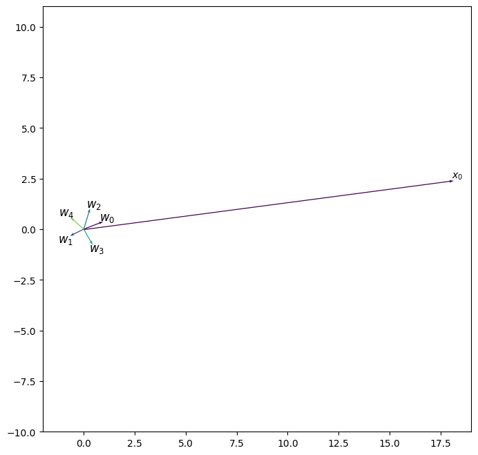
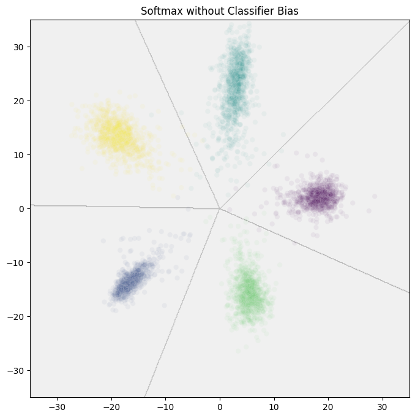
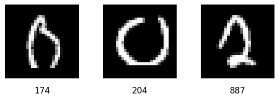
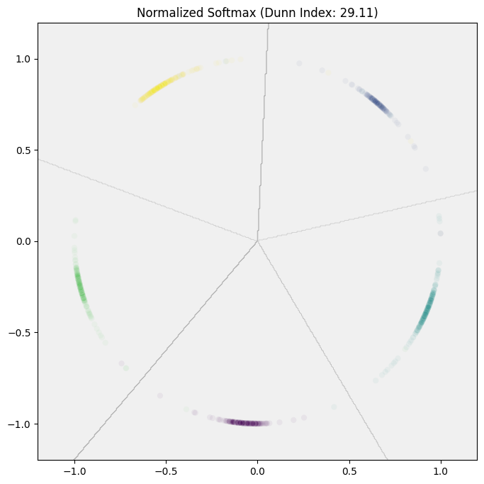

## Introduction

Softmax works great when performing classification where the classes are known up-front, but doesn't provide the best performance out-of-the-box when the classes are open ended. Face identification is one such case of an open ended set of classes. There are over 8 billion faces around today with a new ones born every day, it isn't possible to have samples for each in the training data. Here we will look at how softmax works, why it struggles with open ended datasets, and how ArcFace addresses the problem by adding a margin loss to softmax.

Rather than use a face dataset for this discussion, we'll use the first 5 classes of [MNIST](https://en.wikipedia.org/wiki/MNIST_database), a dataset of hand written digits. Granted, there's little reason to use something like ArcFace with MNIST given the number classes are fixed at a mere 10 classes, but it should allow us to see the significance of what ArcFace does. We will be looking at some snippets of code as well as some results from trained models. The full source code is available [here](some_url).


## A Simple Model for MNIST

MNIST is a data set of 28x28 grayscale images of handwritten digits along with their labels (0-9). They look like this:

<!-- TODO: Image of MNIST dataset sample -->

At a high-level, a model for performing classification on this sort of data will look like this:

<!-- TODO: Make some kind of image for this -->
image --> embedding network --> classifier --> probability distrubtion

The embedding network is responsible for encoding the relevant meaning of the input and mapping it into a vector space. The classifier's job is to then map embeddings to classes. In this case, an embedding network might looks something like this:

```python
class SimpleEmbeddingNetwork(nn.Module):
    def __init__(self, embedding_dim=2):
        super(EmbeddingNetwork, self).__init__()
        self.relu = nn.ReLU()
        self.conv1 = nn.Conv2d(1, 32, kernel_size=3, padding=1, bias=False)
        self.bn1 = nn.BatchNorm2d(32)
        self.pool = nn.MaxPool2d(2, 2)
        self.conv2 = nn.Conv2d(32, 64, kernel_size=3, padding=1, bias=False)
        self.bn2 = nn.BatchNorm2d(64)
        self.fc1 = nn.Linear(64 * 7 * 7, 128, bias=False)
        self.bn3 = nn.BatchNorm1d(128)
        self.fc2 = nn.Linear(128, embedding_dim)

    def forward(self, x):
        # First convolutional block with BatchNorm
        x = self.conv1(x)
        x = self.bn1(x)
        x = self.relu(x)
        x = self.pool(x)

        # Second convolutional block with BatchNorm
        x = self.conv2(x)
        x = self.bn2(x)
        x = self.relu(x)
        x = self.pool(x)

        # Flatten the spatial dimensions
        x = x.view(-1, 64 * 7 * 7)

        # First fully connected layer with BatchNorm
        x = self.fc1(x)
        x = self.bn3(x)
        x = self.relu(x)

        # Output embedding layer
        embedding = self.fc2(x)

        return embedding
```

This embedding network takes digit images as inputs, process them with two convlutional layers, and then outputs 2-dimenstional embeddings (we are using 2D embeddings to make plotting easier).

A standard softmax classifier first produces logits using a linear layer and then applies to the softmax function to the logits to rescale them into a probability distribution. Let's look at the linear layer first:

```python
class LinearClassifier(nn.Module):
    def __init__(self, embedding_dim=2, num_classes=5, bias=False):
        super(LinearClassifier, self).__init__()
        self.fc = nn.Linear(embedding_dim, num_classes, bias=bias)

    def forward(self, x):
        # Project embeddings to class logits
        logits = self.fc(x)
        return logits
```

Understanding how this particular linear layer works turns out to be critical to understanding how ArcFace is going to help us later. To make life easier, we are going to assume we aren't using a bias (though we will look at what happens if one is included later). The math for this linear layer is pretty striaightfoward:

$$
z = x \cdot W^T
$$

Here $x$ will be the embeddings from the embedding network. $W$ is the weight matrix which will have dimensions (5, 2) since we have 5 classes (the digits 0-4) and embedding size of 2. Here is a possible set of values for that weight matrix $W$:

$$
W^T =
\begin{bmatrix}
  0.96 & -0.67 & 0.31 & 0.45 & -0.66 \\
  0.37 & -0.33 & 1.03 & -0.77 & 0.59 \\
\end{bmatrix}
$$

One way to think of this weight matrix is as a collection of vectors, one for each of our 5 classes, we'll label these vectors $w_i$ where $i$ indicates the class. So we'd have the following vectors for our classes, the digits 0 through 4:

$$
\begin{align*}
w_0 = & \begin{bmatrix}
  0.96 \\
  0.37 \\
\end{bmatrix}

& w_1 = & \begin{bmatrix}
  -0.67 \\
  -0.33 \\
\end{bmatrix}

& w_2 = & \begin{bmatrix}
  0.31 \\
  1.03 \\
\end{bmatrix} \\

w_3 = & \begin{bmatrix}
  0.45 \\
  -0.77 \\
\end{bmatrix}

& w_4 = & \begin{bmatrix}
  -0.66 \\
  0.59 \\
\end{bmatrix} \\
\end{align*}
$$

Here I'll refer to these vectors as the *class centers*. So now can look at $W^T$ as being:

$$
W^T = \begin{bmatrix}
w_0 & w_1 & w_2 & w_3 & w_4
\end{bmatrix}
$$

We can similarly $x$ as a bunch of embedding row vectors stacked up on top of eachother. One row vector for each element in the batch:

$$
x = \begin{bmatrix}
x_0 \\ 
x_1 \\ 
x_2 \\ 
\vdots \\
\end{bmatrix}
$$

Now we have:

$$
z = x \cdot W^T = \begin{bmatrix}
x_0 \\ 
x_1 \\ 
x_2 \\ 
\vdots \\
\end{bmatrix}
\cdot
\begin{bmatrix}
w_0 & w_1 & w_2 & w_3 & w_4
\end{bmatrix}
$$

A useful way to think of the dot product of two matrices is that you are taking the dot products of the row vectors on the left with the column vectors on the right, which gives us:

$$
z = \begin{bmatrix}
x_0 \cdot w_0 & x_0 \cdot w_1 & x_0 \cdot w_2 & x_0 \cdot w_3 & x_0 \cdot w_4 \\
x_1 \cdot w_0 & x_1 \cdot w_1 & x_1 \cdot w_2 & x_1 \cdot w_3 & x_1 \cdot w_4 \\
x_2 \cdot w_0 & x_2 \cdot w_1 & x_2 \cdot w_2 & x_2 \cdot w_3 & x_2 \cdot w_4 \\
\vdots & \vdots & \vdots & \vdots & \vdots
\end{bmatrix}
$$

So the output of the linear layer is the dot product of each embedding with each class center. These are called the logits. For each embedding, the largest logit determines the predicted class. Let's look at a specific example. Suppose we have an input like the following:


If we feed this image into our embedding network, we get the following embedding:

$$
x_0 = \begin{bmatrix}
  18.14 & 2.41 \\
\end{bmatrix}
$$

Now that we have the embedding, we can compute the logits, $z$:

$$
\begin{align*}
z & = x \cdot W^T \\
 & = \begin{bmatrix}
x_0 \\
\end{bmatrix}
\cdot
\begin{bmatrix}
w_0 & w_1 & w_2 & w_3 & w_4
\end{bmatrix} \\
& =\begin{bmatrix}
x_0 \cdot w_0 & x_0 \cdot w_1 & x_0 \cdot w_2 & x_0 \cdot w_3 & x_0 \cdot w_4 \\
\end{bmatrix} \\
& = \begin{bmatrix}
\begin{bmatrix}
  18.14 & 2.41 \\
\end{bmatrix}
\cdot
\begin{bmatrix}
  0.96 \\
  0.37 \\
\end{bmatrix}
& \dots & 
\begin{bmatrix}
  18.14 & 2.41 \\
\end{bmatrix}
\cdot
\begin{bmatrix}
  -0.66 \\
  0.59 \\
\end{bmatrix}
\end{bmatrix} \\
& = \begin{bmatrix}
  18.30 & -13.03 & 8.16 & 6.22 & -10.52 \\
\end{bmatrix}
\end{align*}
$$

We can see that the dot product of $x_0$ with the class center $w_0$ is the largest, which makes sense since $x_0$ was the embedding of an image of a 0 and $w_0$ is the class center for the 0-digit class.

The dot product has a relevant geometric interpretation, it is the magnitude of the vectors scaled by the cosine of the angle inbetween them:

$$
v \cdot u = \|u\|\|v\|cosine(\theta)
$$

When $\theta$ is 0, the cosine is 1, making the dot product just the product of the vector magnitudes. When $\theta$ is 90 degrees, the cosine is 0 as is the dot product. When $\theta$ is 180 degrees, the cosine is -1 and the dot product is the product of the magnitude of the vectors times -1. If we plot the vector of our embedding with the vectors of the class centers, we get the following:



If we look at the vectors for the class centers, they all have similar and relatively low magnitudes and so cluster around the origin. The the class centers $w_1$ and 4 point in the opposite direction of our sample, which lines up with the negative dot products of -13.03 and -10.52 respectively that we calculated earlier. Since the angle in between the sample's vector and that of the class centers for 2, 0, and 3 is less than 90 degrees, the dot products for them are all positive. However, the angle between class 0 and the sample is quite small, so it ends up having the largest dot product of 18.30.

### Softmax

Now that we've looked at embeddings and their relationship to the class centers, now we need to figure out how to turn our logits into a probability distribution. If we look at the logits from our previous example:

$$
z = \begin{bmatrix}
  18.30 & -13.03 & 8.16 & 6.22 & -10.52 \\
\end{bmatrix}
$$

From the logits, we can tell that 0 should be the most likely class and 1 the least likely. Lets break up this row vector into the logits for each class. We'll say $z_0$ is the logit for class 0, $z_1$ is the logit for class 1, etc. We can then sort them from most to least likely:

$$
\begin{align*}
z_0 & = 18.30 & & z_0 = & 18.30 \\
z_1 & = -13.03 & & z_2 = & 8.16 \\
z_2 & = 8.16 & \text{sort} \rightarrow  \text{ }& z_3 = & 6.22 \\
z_3 & = 6.22 & & z_4 = & -10.52 \\
z_4 & = -10.52 & & z_1 = & -13.03
\end{align*}
$$

To get a probability distribution, we might be tempted to just add all the logits together and divide each logit by the sum. However, some of the logits are negative... so that won't work. Here's a trick though, what if we raise 10 by the power of each logit:

<!-- 
array([1.9907161e+18, 9.2275613e-14, 1.4458742e+08, 1.6655626e+06,
       3.0521898e-11], dtype=float32)
-->

$$
\begin{align*}
z_0 &=  18.30 \\
z_2 &=  8.16 \\
z_3 &=  6.22  \\
z_4 &=  -10.52 \\
z_1 &=  -13.03 \\
\end{align*}
\quad
\rightarrow
\quad
\begin{align*}
10^{z_0} &= 10^{18.30} &=& 2.00 \times 10^{18} \\
10^{z_2} &= 10^{8.16} &=& 1.45 \times 10^8 \\
10^{z_3} &= 10^{6.22} &=& 1.67 \times 10^6 \\
10^{z_4} &= 10^{-10.52} &=& 3.05 \times 10^{-11} \\
10^{z_1} &= 10^{-13.03} &=& 9.23 \times 10^{-14} \\
\end{align*}
$$


Notice that this transformation didn't change the ordering of the logits. $z_0$ is still the most likely and $z_1$ the least. However, it has transformed our negative numbers into really small, but positive, numbers. Now we can sum the numbers together and divide to get our probabilities:

$$
\begin{align*}
\sum{10^{z_i}} &= 2.00 \times 10^{18} + \dots +  9.23 \times 10^{-14} \\
&\approx 2.00 \times 10^{18}
\end{align*} 
$$

$$
\begin{align*}
\frac{10^{z_0}}{2.00 \times 10^{18}} \approx 1.00 \\
\frac{10^{z_2}}{2.00 \times 10^{18}} \approx 0.00 \\
\frac{10^{z_3}}{2.00 \times 10^{18}} \approx 0.00 \\
\frac{10^{z_4}}{2.00 \times 10^{18}} \approx 0.00 \\
\frac{10^{z_1}}{2.00 \times 10^{18}} \approx 0.00 \\
\end{align*}
$$

This is exactly what the softmax function does, except instead of using 10, it uses euler's number, $e$:

$$
\begin{align*}
\sum{e^{z_i}} &= e^{z_0} + \dots + e^{z_4} \\
&= e^{18.30} + \dots + e^{-10.52} \\
&= 8.85 \times 10^7
\end{align*}
$$


<!--

8.8543880e+07, 2.1827768e-06, 3.4986423e+03, 5.0348843e+02,
        2.7115957e-05

-->

$$
\begin{align*}
\frac{e^{z_0}}{8.85 \times 10^7} \approx 1.00 \\
\frac{e^{z_2}}{8.85 \times 10^7} \approx 0.00 \\
\frac{e^{z_3}}{8.85 \times 10^7} \approx 0.00 \\
\frac{e^{z_4}}{8.85 \times 10^7} \approx 0.00 \\
\frac{e^{z_1}}{8.85 \times 10^7} \approx 0.00 \\
\end{align*}
$$

In this case, the model indicates our sample, with embedding $x_0$, has essentially a 100% chance of being the digit 0. Succinctly, if we have a vector $z$, then the softmax of $z$ is defined componentwise by:

$$
\sigma(z)_i = \frac{e^{z_i}}{\sum{e^{z_k}}}
$$

Okay, so now we've covered how to get from embeddings to a probability distribution. Now let's look at why this isn't good enough when we do not know all the classes up-front.


## Trouble with Open Ended Classes

So when we have open ended classes, like we do in the case of face identification, we often need to compare two samples to know if they are of the same class. We might compare to picutures of a face to determine if they are of the same face or not. Since the classifier will only know of classes in the training data, we cannot typically rely on it. That means we must compare the embeddings in some way to determine this. If our embedding network maps members of the same class near eachother in the embedding space, then we could compare the distances between the embeddings to see if they are of the same class or not. So when we train such a network with a softmax classifier, do we get such a capable embedding network.


Returning to our example softmax model, here is how it maps our test data into the embedding space:



Here we see the embeddings of our 5 classes which have, loosely, clustered together. The grey lines represent the boundaries between the classes. Ideally, we'd like to see these cluster's spaced far apart from each other and for all members of a cluster to be packed in close together. In particuar, members of a given class should be closer together in the embedding space than to any member of any other class. So is that what has happened here? Consider these samples:



The above three samples were classified correctly by the classifier. Samples 174 and 204 are of class 0 and sample 887 is of class 2. However, sample 174 is closer, whether looking at euclidean or cosine distances, to sample 887 than it is to sample 204. This means there isn't a distance threshold we could use that would tell us that 174 is the same class as 204, and that 174 is _not_ the same class as 887. So distances in the embedding space are not always reliable in determining if two samples belong to the same class. How reliable they are depends on how well separated our classes and on how tightly packed the members of a class are. If we want to improve our model, we'll need some way to measure and compare models based on these properties, which brings us to the Dunn Index.


## Dunn Index

When looking at the quality of clustering, we care about two things: how well separated are the clusters (inter-class distance), and how cohesive are the classes (intra-class distance). We want to maximize the inter-class distances and minimize the intra-class distances. The Dunn Index, from [A Fuzzy Relative of the ISODATA Process and Its Use in Detecting Compact Well-Separated Clusters (Dunn, J. C., 1973)](https://doi.org/10.1080/01969727308546046), is a metric for comparing these qualities. The metric has roughly the following form:

$$
DI = \frac{\text{min class distance}}{\text{max distance betweem members of the same class}}
$$

A higher value for the dunn index means the classes are well separated and cohesive, and a lower value means the classes not well separated or cohesive. If we look at the above definition, there are two ways we can improve the Dunn Index: push the classes further apart which will give us a larger numerator, or pack the members of each class closer together which will give us a smaller denominator.

One of the downsides of the dunn index is that because it compares a minimum with a maximum, it is sensitive to outliers. As such, there are a number of variations of the Dunn Index that try to mitigate this. The one we will use here involves dropping all members of a class that are beyond the 95th percentile of the distances from the centroid of that class. This ensures that a single errant embedding does not torpedo the Dunn Index. This is a simple way to make the Dunn Index more robust to outliers, and it works well in practice. The code for this is available in the source code repository.

If we compute the Dunn Index for our current softmax model, we get a value of 5.31. Now let's look at how we can improve the model.

## Normalized Softmax

You'll recall that we have the following calculation for the logits:

$$
z = \begin{bmatrix}
x_0 \cdot w_0 & x_0 \cdot w_1 & x_0 \cdot w_2 & x_0 \cdot w_3 & x_0 \cdot w_4 \\
\vdots & \vdots & \vdots & \vdots & \vdots
\end{bmatrix}
$$

During training, the model tries to maximize the dot product of the embedding with the class center for the correct class, while minimizing the dot products with all other classes. How can the model increase the dot product? Let's take another loot at the definition of the dot product:

$$
x \cdot w = |x||w| cos \theta
$$

We can increase the dot product by increasing the magnitudes of either $x$ or $w$, or by decreasing the angle $\theta$ between them. If we look at the embedding space, we can see that increasing the magnitudes of the embeddings is often how things go:


Increasing the magnitudes in this way makes the euclidean distances between members of the same class larger and more varied, which is not helpful. And since the model has this knob of increasing the magnitudes of the embeddings, it will be less prone to minimizing the angle between the embeddings and the class centers. This means that not only do the euclidean distances suck, but the cosine distances do too.

In [NormFace: L₂ Hypersphere Embedding for Face Verification (Wang et al, 2017)](https://arxiv.org/abs/1704.06369) address the problem by normalizing the embeddings and the class centers before computing the dot product. This means the magnitudes of the embeddings and class centers are always 1, so the dot product is simply the cosine of the angle between them. Now the logits are computed as follows:

$$
z = \begin{bmatrix}
\frac{x_0}{\lVert x_0 \rVert} \cdot \frac{w_0}{\lVert w_0 \rVert} & \frac{x_0}{\lVert x_0 \rVert} \cdot \frac{w_1}{\lVert w_1 \rVert} & \dots & \frac{x_0}{\lVert x_0 \rVert} \cdot \frac{w_4}{\lVert w_4 \rVert} \\
\vdots & \vdots & & \vdots
\end{bmatrix}
$$

By depriving the model of the ability to increase magnitudes to improve the dot product, we force it to focus on minimizing the angle between the embeddings and the class centers.

To effect this change, we need to modify our embedding network's `forward(...)` method to normalize the embeddings before passing them to the classifier:

```python
class EmbeddingNetwork(nn.Module):
    
    # ... other methods ...

    def forward(self, x):
        # ... layers before the embedding layer ...

        # Output embedding layer
        embedding = self.fc2(x)

        # Normalize the embedding
        embedding = F.normalize(embedding, p=2, dim=1)

        return embedding
```

Then we create a new classifier that normalizes the class centers before computing the logits:

```python
class CosineClassifier(nn.Linear):
    def __init__(self, embed_dim, num_classes, bias=False):
        super().__init__(embed_dim, num_classes, bias=bias)

    def reset_parameters(self):
        super().reset_parameters()
        # Initialize weights using Xavier uniform initialization
        nn.init.xavier_uniform_(self.weight)
        if self.bias is not None:
            nn.init.constant_(self.bias, 0.0)

    def forward(self, z):
        # Compute cosine similarity by using normalized weight vectors
        x = F.linear(z, F.normalize(self.weight, dim=1), self.bias)
```

Training the model we get the following embeddings for the test data:



The Dunn Index for this model is 29.11, a clear improvement over the previous model. But we can do even better.


# ArcFace Additive Margin Loss

Now that we have normalized the embeddings and class centers, rather than writing the dot product for the logits as:

$$
z = \begin{bmatrix}
\frac{x_0}{\lVert x_0 \rVert} \cdot \frac{w_0}{\lVert w_0 \rVert} & \frac{x_0}{\lVert x_0 \rVert} \cdot \frac{w_1}{\lVert w_1 \rVert} & \dots & \frac{x_0}{\lVert x_0 \rVert} \cdot \frac{w_4}{\lVert w_4 \rVert} \\
\vdots & \vdots & & \vdots
\end{bmatrix}
$$

We can instead write it as:

$$
z = \begin{bmatrix}
cos(\theta_{x_0,w_0}) & cos(\theta_{x_0,w_1}) & \dots & cos(\theta_{x_0,w_4}) \\
\vdots & \vdots & & \vdots
\end{bmatrix}
$$

Where $\theta_{x_0,w_i}$ is the angle between the embedding $x_0$ and the class center $w_i$. We can do this because the dot product is $|u||v| cos(\theta)$, and since we have normalized the embeddings and class centers, the magnitudes are both 1. So the dot product is simply the cosine of the angle between them.

Where ArcFace comes in is by adding a margin to the angle between the embedding and the class center for the correct class during training. This is done by adding a margin $m$, a hyperparameter, to the angle for the correct class. So if we have an embedding sample $x_0$ representing the digit 0, we would compute the logits as follows:

$$
z = \begin{bmatrix}
cos(\theta_{x_0,w_0} + m) & cos(\theta_{x_0,w_1}) & \dots & cos(\theta_{x_0,w_4}) \\
\vdots & \vdots & & \vdots
\end{bmatrix}
$$

What does this do? Suppose $\theta_{x_0,w_0}$ is 0.5 radians (approximately 29 degrees), then the logit for the correct class would be `cos(0.5) = 0.88`. Now lets say we add this margin, $m$, with a value of 0.5. Then we'd have `cos(\theta_{x_0,w_0} + m) = cos(0.5 + 0.5) = 0.54`. Critically, we only add this margin to the angle for the correct class, so the logits for the other classes remain unchanged. This effectively reduces the probability of the sample being classified as the correct class, and increases the probability of it being classified as one of the other classes. During training, this forces the model to reduce the angles, $\theta$, even further between the embeddings and the class centers. By reducing the angles, we pull samples away from the class boundaries and towards the class centers, which creates more cohesive clusters and better separates the classes.

To help us understand how to implement this, lets look at a real example. Consider the sample from out traing data that we used earlier:


Since this is a different model, we will have a different embedding for the sample, which is:

$$
x_0 =\begin{bmatrix}
  0.62 & 0.78 \\
\end{bmatrix}
$$

We have the following for our classifier weights, $W^T$:

$$
W^T = \begin{bmatrix}
  0.37 & 0.46 \\
  -0.35 & 0.49 \\
  -0.05 & -1.19 \\
  0.34 & -0.12 \\
  -0.45 & -0.14 \\
\end{bmatrix}
$$

Which gives us the following class centers:

$$
\begin{align*}
w_0 = & \begin{bmatrix}
  0.37 \\
  0.46 \\
\end{bmatrix}
& w_1 = & \begin{bmatrix}
  -0.35 \\
  0.49 \\
\end{bmatrix}
& w_2 = & \begin{bmatrix}
  -0.05 \\
  -1.19 \\
\end{bmatrix} \\
w_3 = & \begin{bmatrix}
  0.34 \\
  -0.12 \\
\end{bmatrix}
& w_4 = & \begin{bmatrix}
  -0.45 \\
  -0.14 \\
\end{bmatrix}
\end{align*}
$$

Now we can compute the logits:

$$
\begin{align*}
z & = \begin{bmatrix}
x_0 \cdot w_0 & x_0 \cdot w_1 & x_0 \cdot w_2 & x_0 \cdot w_3 & x_0 \cdot w_4 \\
\end{bmatrix} \\
& = \begin{bmatrix}
\begin{bmatrix}
  0.62 & 0.78 \\
\end{bmatrix}
\cdot
\begin{bmatrix}
  0.37 \\
  0.46 \\
\end{bmatrix}
&
\dots
& 
\begin{bmatrix}
  0.62 & 0.78 \\
\end{bmatrix}
\cdot
\begin{bmatrix}
  -0.45 \\
  -0.14 \\
\end{bmatrix}
\end{bmatrix} \\
& = \begin{bmatrix}
  0.59 & 0.16 & -0.96 & 0.11 & -0.39 \\
\end{bmatrix} \\
& = \begin{bmatrix}
cos(\theta_{x_0,w_0})  & \dots & cos(\theta_{x_0,w_4}) \\
\end{bmatrix}
\end{align*}
$$

Now we know our values for the logits, and consequently the angles, $\theta$, between the embedding and the class centers. We get all of this already from the normalized softmax model. Now we just need to add the margin, $m$, to the angle for the correct class. Let's say we choose a margin of 0.5 radians. The correct class is 0, so we need to find the value of $cos(\theta_{x_0,w_0} + m)$. Well, we know `cos(\theta_{x_0,w_0}) = 0.59`... but how do we add the margin. Many years ago, back in trigonometry class, you were learning about trigonometric identities, and were probably wondering when you would ever possibly use them. Well, today is the day! We can use the cosine addition formula to compute this:

$$
cos(\theta + m) = cos(\theta)cos(m) - sin(\theta)sin(m)
$$

We know $\cos(\theta_{x_0,w_0}) = 0.59$, and we can compute $\cos(m)$ and $\sin(m)$ since we know the margin, $m$, is 0.5 radians:

$$
\begin{align*}
\cos(m) & = \cos(0.5) \approx 0.88 \\
\sin(m) & = \sin(0.5) \approx 0.48
\end{align*}
$$

Now we just need to compute $\sin(\theta_{x_0,w_0})$. We can do this using the Pythagorean identity:

$$
\sin^2(\theta) + \cos^2(\theta) = 1 \quad\rightarrow\quad
\sin(\theta) = \sqrt{1 - \cos^2(\theta)}
$$

So we have:

$$
\sin(\theta_{x_0,w_0}) = \sqrt{1 - (\cos(\theta_{x_0,w_0}))^2} = \sqrt{1 - 0.59^2} \approx 0.81
$$

Now we can compute the logit for the correct class:

$$
\begin{align*}
z_0 & = cos(\theta_{x_0,w_0} + m) \\
& = cos(\theta_{x_0,w_0})cos(m) - sin(\theta_{x_0,w_0})sin(m) \\
& = 0.59 \cdot 0.88 - 0.81 \cdot 0.48 \\
& \approx 0.52
\end{align*}
$$

Before we get to the code, there is one more pesky little problem. When we add this margin to a logit, the goal is to make the logit smaller so that it is harder to classify the sample correctly. However, there is an edge case where adding the margin actually increases the logit. Suppose by some twist of fate $\theta_{x_0,w_0}$ is actually $\pi$ radians. In this scenario, the $\cos(\theta_{x_0,w_0})$ would be -1, the smallest possible value for the cosine of an angle. If we add a margin of 0.5 radians, then we would have $\cos(\theta_{x_0,w_0} + m) = \cos(\pi + 0.5) \approx -0.88$. This is actually larger than -1, which is not what we want. This problem arises any time that $\cos(\theta_{x_0,w_0}) < \cos(\pi - m)$. To fix this, we need an alternative penalty we can add that won't push the angle past $\pi$.

<!-- 
LEAVE THIS COMMENT
-->

So what we've covered so far works great when the total number of classes is known up-front. However, what do we do when we have a sample for a class that was not in our training data. For face identification task, this would be a face of someone not in the training data, or in our example, it might be a digit not in our training data, like the digit 7. Well the classifier would be of no use, it only has outputs for classes in the training data.

<!--

with all the percision of a shotgun blast into the embedding space

-->

## Measuring Clustering Quality


We will start by looking at how we might approach this problem using standard softmax and where that breaks down, and then look at how ArcFace solves the problem. For demonstrative purposes, we will use embeddings of only 2 dimensions (as this makes drawing much easier), and assume a training data set of 5 identities: Tom Hanks, Cate Blanchett, Morgan Freeman, Meryl Streep, and Harrison Ford.


## Explain embeddings and dot product

When building a face recognition model using SoftMax, we can break down the network into three components:

1. **Training Data**: This is a collection of face images along with their respective identities as one-hot vectors.
2. **Embedding Network**: This network takes an image of a face and maps it to an embedding, a real valued vector representing the face's identity. This embedding should have a meaningful spatial relationship with other embeddings of images of faces with the same identity. This network might leverage an existing off-the-shelf model architecture such as ResNet, ViT, etc.
3. **Classifier Network**: The classifier network maps embeddings to probability distributions over the available classes. It effectively tells us the likely class of a given embedding, and consequently the face image from which the embedding was derived.

For demonstrative purposes, lets assert the following:
- Our training data consists of face images for 5 identities: Tom Hanks, Cate Blanchett, Morgan Freeman, Meryl Streep, and Harrison Ford
- Our embedding network outputs 2D embeddings (for the sake of making plots easier)

image --> embedding network --> embedding --> classifier --> probability distribution

The classifier network will be our main focus. The classifier network involves two components: a linear layer and the softmax function. The linear layer involves taking the dot product of an embedding with a weight matrix W and adding a bias b. Lets suppose we have the following for the weight matrix and bias:

$$
\begin{align*}
W = & \begin{bmatrix}
1.0 & -1.2 \\
-0.5 & 0.2 \\
2.2 & -1.5 \\
-2.2 & 1.5 \\
2.7 & -0.1
\end{bmatrix} \\
\\
b = & \begin{bmatrix}
0.1 & 0.3 & 0.5 & 1.0 & 0.8
\end{bmatrix}
\end{align*}
$$

Using an off-the-shelf computer vision model as the base, we can build a network that produces embeddings representing face identities as the output. So it takes an image of a face as an input and outputs an embedding representing the face's identity as an output. Lets call this network the embedding network. The embeddings will be vectors of 2 dimensions (to make visualization easier to draw and understand). I'll denote these output embeddings using $x$.

Unfortunately, we don't have embeddings in our training data, just pictures of people for each class (the classes in this case being the actors mentioned above). To bridge this gap, we'll need a classifier network. The classifier network takes embeddings as input and outputs a probability distribution over the classes in the training data, indicating how likely a given embedding is to belong to each class. So so far we have this:

image --> embedding-network --> embedding --> classifier --> probability distribution

The classifier contains two pieces, the classifier weights $W$, and the SoftMax function. $W$ is a matrix that really just a collection of vectors representing each class. Each of these vectors will be represented with $w$ and a subscript indicating the class. In this case, we'll have $w_tom$, $w_cate$, $w_morgan$, $w_meryl$, and $w_harrison$. The matrix might look something like this:

TODO: a Matrix W with some weights and an indicator as to the class vectors.

Our embedding $x$ is multiplied by the matrix $W$ to produce logits, $z$. To explain what the logits are, lets dig deeper into what happens when we multiply $x$ and $W$:

$$
z = x \dot W
$$

When we take the dot product between two matrices (or a row vector and a matrix in this case), what we are really doing is taking the dot product between each row vector on the left with each column vector on the right. This yields a new matrix, or in this case row vector since we only have one embedding here, like this:

$$
z = x \dot W = [ x \dot w_tom, x \dot w_cate, x \dot w_morgan, x \dot w_meryl, x \dot w_harrison]
$$

The dot product of two vectors is the product of the magnitudes of each vector scaled by the cosine of the angle in between them:

$$
x \dot w = |x||v| cos \theta
$$

So if two vectors point in the same direction (have $\theta close to 0), and each have a large magnitude, then their dot product will also be large. If two vectors have a $\theta$ of 90 degrees, then the dot product will be 0 irrespective of the magnitudes of the vectors (since the cosine of 90 degrees is 0). Ideally, we want the dot product for x to be largest with the vector $w$ representing the correct class and small for all other classes. We will also use a set of biases, $b$, as is common with classifiers, for each class which is simply added on to our dot product. After training, these biases will often reflect the frequency of each class in the training data. So if the training data contains more pictures of Harrison Ford than anyone else, the $b_harrison$ will be the largest bias. This gives us an equation for the logits as follows:

$$
z = x \dot W + b = [ x \dot w_tom + b_tom, x \dot w_cate + b_cate, x \dot w_morgan + b_morgan, x \dot w_meryl + b_meryl, x \dot w_harrison + b_harrison]
$$

With the logits alone, we can rank the categories for an embedding $x$ from most likely to least likely, but we still need to cajole these logits into a probability distribution. Lets consider the following case:

TODO: example where some of the logits end up being negative

One thing you might think to try to turn the above logits into a probability distribtuion is to simply add all the logits together and then divide each logit by the sum. Unfortunately, some of the numbers are negative, so this won't work. One neat transformation we could do is 10 to the power of each logit, like so:

$$
z = [1, -1, 0.5, -0.25, 3]

10^z = [10^1, 10^-1, 10^0.5, 10^-0.25, 10^3] = ...
$$

Notice how this operation does change the relative ordering of the logits, however it does make the logits all positive numbers. Now we can sum them together and divide each logit by the sum to get our probability distribution. This is exactly what the softmax function does:

$$
softmax(v) = u where u_i = \frac{e^{v_i}}{sum e^{v_j}}
$$

This does effectively the same thing, except using euler's number, instead of 10:

$$
z = [1, -1, 0.5, -0.25, 3]

e^z = [e^1, e^-1, e^0.5, e^-0.25, e^3] = ...

sum e^z = ....

softmax(z) = e^z / (sum e^z) = [....]
$$

We now have our probability distribution. This gets us from an image of a face, to an embedding the encodes the face's identity, to a probability distribution among our 5 possible classes. Let's run through of how this all works using a picture of Harrison Ford:

harrison ford --> embedding network --> embeddings --> classifier weights --> logits --> probability distribution


## Explain how SoftMax scales logits into a probability distribution

## Weight vectors establish class boundaries

## Inter-class and Intra-class distances with normal SoftMax

## Remove bias when calculating logits

## Normalize the embeddings and weight matrix

## More ways to think about dot products (product of magnitudes scaled by cosine of the angle)

## Adding a margin to the correct category for each sample