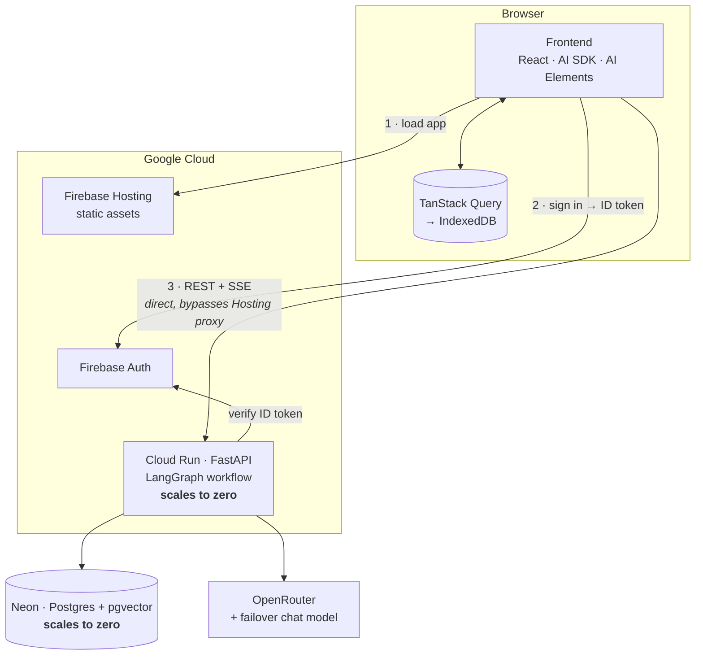

## Introduction

So far in this series, we've covered how [Boardbarian](https://boardbarian.com) answers user questions about board games, and the evaluation system that keeps those answers honest. Here we will talk about how the architecture of the system evolved to support this functionality. 

I didn't start out with a clear system design in mind. I was far more interested in solving problems with small models and getting reliable outputs. Once I started getting reliable outputs, and challenges like PDF ingestion got resolved, I turned my attention to the system architecture, and came up with these requirements:

1. **Cheap.** We covered part of this in the first post by choosing to use a smaller Qwen model for inference. However, now we have to consider the cost of the entire system.
2. **Automated.** This is a side-project, I don't want to have to remember whatever maze I went through in the GCP Console UI to get the system running. I want a single command I can run to both save time and not have to remember all the steps.
3. **Reliable.** It should work. It should just work, and not, some days, fail to operate.

Here is where the system ended up. The rest of this post is the story of how it got here:

## Where we started

I began work on this project, off and on, in 2023. Back then, the hard problem was getting reliable answers out of small models, so for most of the stack I picked whatever let me build the least:

* LangChain, later joined by LangGraph, as the agent framework, because its ecosystem meant most integrations already existed.
* Chainlit as the UI, because it gave me a working chat interface without having to build a frontend.
* Inference run locally on my homelab during development (eventually settling on vLLM), with the plan of using a third-party on-demand service in production.

The exception was persistence. There I chose Astra Serverless, partly out of familiarity, since I work on that product at IBM (it's effectively Cassandra-as-a-Service), but also because I saw a chance to build something on top of it that would make it more relevant to LangGraph and Chainlit users. Neither supported it, so I wrote a [LangGraph checkpointer](https://github.com/johntrimble/langgraph-checkpoint-cassandra) and a [Chainlit data layer](https://github.com/johntrimble/chainlit-cassandra-data-layer) backed by Cassandra, both of which are still on GitHub. That made Astra Serverless the one part of the stack that was more work to use, not less, and that custom code is complexity I would eventually cut.

At this point I had a working system, but then I started to think about costs.

## The problem with Chainlit

Now the total active user count on Boardbarian I expect to be quite low. I mainly see it as more of a portfolio piece than a product. Ideally, if the user count is zero, my backend should scale to zero. For this, I ultimately went with Cloud Run. But there was a problem. Chainlit keeps a websocket connection open to the backend, even when there is no user activity. This means if someone opens the site and just leaves it open in their browser, the backend will never scale to zero. Now, the websocket is great for streaming back information to the user about what the agent is doing, but in my use case, those sorts of events only happen in response to a user query, and end as soon as the query is answered. What made more sense for me was for the frontend to post a user message, and to then use an SSE (Server-Sent Events) connection to stream back the response to that message. Once the response is complete, the SSE connection can be closed. This prevents an idle connection from keeping the backend alive, and allows the backend to scale to zero when there are no active users.

When looking for prior art on this approach, I found that this is exactly what Vercel does. I ended up rolling a custom frontend (well, mostly Claude did) using Vercel's AI SDK and AI Elements components. On the backend, I hand-rolled an implementation of Vercel's UI Message Stream format.

## Do I really need Astra Serverless?

Having moved away from Chainlit, I no longer had a need for my Chainlit data layer. Instead, I'd have to make something else for storing user info and message history. I also realized that, for the way I was using LangGraph, I didn't need the checkpointer either. With none of my custom Astra Serverless code needed anymore, I decided to reconsider what to use for a datastore. I have the following sorts of information that need to be stored:

* Chats and message history
* User information
* Token usage
* Rule chunk embeddings
* Rule chunks
* Game information

Nothing in that list is particularly elaborate, and the access pattern is also mostly boring, except for the rule chunk embeddings. Board games tend to give specific meanings to words, and so I wanted something that would support hybrid search using both the embeddings and the text of the rule chunks. I tend to run a lot of evals using my homelab as well, so I needed a solution I could also run locally. 

I settled on using Postgres with the pgvector extension. This allows me to run the system locally, and also use a managed Postgres service in production, for which I picked Neon. I partition the chunk table by game ID (technically, game version, there is a layer of indirection to make updated ingestions of game data consistent) since I never need to do a search across games. One of the main benefits of using Postgres is that a lot of the things I use just support it out-of-the-box, like LangChain (this is the ecosystem support I mentioned earlier). Neon also has a pretty generous free tier.

## Outsourcing auth and hosting to Firebase

With the backend running on Cloud Run, I needed to host the frontend somewhere. I also needed to sort out how to handle authentication. I really didn't want to build my own auth system, but I needed something to control access to the backend. I ended up using Firebase for both auth and hosting the frontend. There are many solutions out there for this, but since I was already in the Google ecosystem with Cloud Run, it made sense to use Firebase. The only hiccup I encountered was that the Firebase Hosting proxy doesn't support SSE (it caches all events and then sends them all at once when the connection is closed). This means the frontend has to connect directly to the backend which is not on the same domain as the frontend, which caused some irritation getting CORS working correctly.

## Hiding a 20-second cold start

By far the biggest drawback of using Cloud Run with scale to zero and Neon, which I also have configured to scale to zero, is the cold start time. Even after spending a fair amount of time reducing the size of the API image, and the startup time of the process, the cold start time is still around 20 seconds. Basically, an eternity. The main landing page doesn't use the backend at all, but as soon as the user logs in and looks at the list of available games, the backend is called.

To give the appearance of faster response times, I aggressively cache data on the frontend. The list of games, chat history, and user information are all cached on the frontend, more-or-less indefinitely. The UI is also optimistic, assuming that the backend will respond successfully. In this way, a user can log in, select a game, and start a chat without having to wait for the backend at all. To facilitate this, I use TanStack Query on the frontend with IndexedDB as the cache store.

There are two places where this deception breaks down:

1. Waiting for a response to a user message. The backend needs to be online before a response can be generated. When there is a cold start, the user will end up waiting for a response to their message 20 seconds or so longer than normal.

2. New users always have to wait the first time they log in on a device. This is just the reality of there being nothing cached on the frontend yet.

For the first case, responses are already not instantaneous, so the problem there feels less pronounced. The second case is more of a problem though. Right now, the user just suffers the cold start time, but I'm thinking of moving the game list and metadata to Cloud Storage and not requiring auth to access it. This would allow a new user to see the list of games, be able to select one, and start a chat without having to wait for the backend to come online. Not a difficult change to make, but it does require some changes to the frontend and backend, so I haven't done it yet.

## When your provider drops your model

For inference, I originally used Atlas Cloud. As covered in the previous post, they discontinued support for the model I was using just as I was pushing everything out the door and into prod. They also made a change to their API such that they no longer supported forced tool calls. I'd known that this was a possibility, but I'd hoped it wouldn't be an issue right away. The simple solution here is to just use OpenRouter, but different providers support different sampling parameters, and different API features (like, for example, around tool calls). I ended up using OpenRouter plus a custom LangChain ChatModel implementation with fallbacks to different models and different sampling parameters.

With this setup, inference provider failures are generally unnoticeable to the user. If an error occurs, it triggers a circuit breaker and that model will not be used again for the next 10 minutes, and the request is retried against the next provider in the list. So far, most failures I've experienced are outright rejections of the request from the provider (for example, I got a 'model does not exist' error from Atlas Cloud when they discontinued the model I was using). Consequently, the user will scarcely even notice a delay in response time, and will generally not see an error message unless all the providers fail.

## Making infrastructure boring

On the automation side, I use Terraform to manage all the infrastructure: Firebase Hosting, Firebase Auth, Cloud Run, Cloud Storage, Neon, DNS, etc. I also use GitHub Actions to both build and deploy the API image to Google Artifact Registry. Deploys are as simple as running `terraform apply`. I use a Terraform skill with Claude Code, and do almost all infrastructure changes using Claude. That's really it. Terraform, GitHub Actions, and Claude make management of infrastructure pretty boring, and I don't have to remember all the steps to get the system up and running.

One thing that is not automated presently is the ingestion of board game data. That still has a fair number of manual steps. Automating it is on my list of things to do, but it's not a high priority since the data doesn't change that often. The ingestion process is also not particularly difficult, so it's not a huge burden to do it manually.

## Conclusion

Almost none of the original stack survived contact with the requirements. Chainlit gave way to a custom frontend so the backend could scale to zero. Astra Serverless gave way to Postgres on Neon once the custom code justifying it was gone. A single inference provider gave way to OpenRouter with fallbacks after that provider demonstrated exactly why depending on one is a mistake. Looking back at the requirements:

1. **Cheap.** Every component either scales to zero (Cloud Run, Neon) or sits comfortably in a free tier (Firebase, GitHub Actions). At zero users, the whole system costs effectively nothing. The only cost that grows with usage is inference, and the first post already put that at about half a cent per question. The price of all this is the cold start: twenty seconds of scale-to-zero tax, mostly hidden by aggressive caching and optimism on the frontend.

2. **Automated.** The entire infrastructure is described in Terraform, and the API image builds and deploys through GitHub Actions. Getting the system running is `terraform apply`, not a maze of console screens I'd have to rediscover six months from now.

3. **Reliable.** The circuit breaker and fallback chain mean a misbehaving inference provider is invisible to the user: a provider dropping my model is a configuration change, not an outage. Everything else is managed services with far better uptime than anything I would run myself.

If there is a theme here, it's the same one as the first post: a single choice did most of the deciding. There it was small models; here it is scaling to zero. Chainlit was replaced because of it, the cold start exists because of it, and the frontend caching exists because of the cold start. Cheap set the direction, and the architecture is the downstream consequences.

This is the last post in the series. We started with a question: can a small model answer real rules questions, reliably and for about half a cent each? The answer turned out to be yes, correct about nine times in ten on the eval suite, but only with a workflow that keeps the model on rails, an eval suite that catches it when it slips, and an architecture that costs nothing while nobody is playing. You're welcome to change that: Boardbarian is live at [boardbarian.com](https://boardbarian.com).