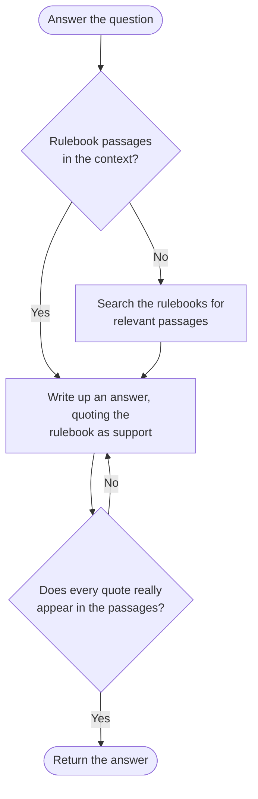
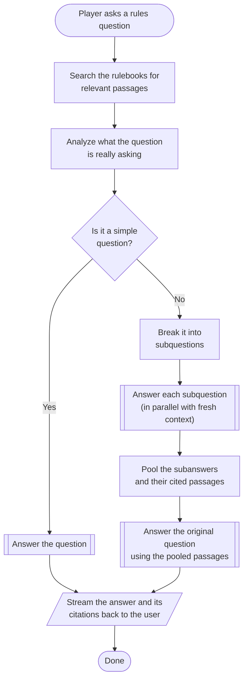

## Introduction

I enjoy board games, but they are often complex, with many rules and rule interactions to keep track of. I've been in gaming sessions where I spent more time puzzling over the specific wording of a rule or digging through tomes of text seeking clarity than actually playing the game. What's worse, I've on occasion thought I'd resolved a rule question, only to later discover a relevant exception buried in a different section of the rulebook.

With rulebooks for popular games like *Gloomhaven* exceeding 70 pages, it is easy to see how players can get lost. The problem grows far worse if we include miniature wargames, which often have hundreds of pages of rules and errata. I wanted to build a tool to help players get answers to their questions quickly and accurately, so they can spend more time playing and less time looking up rules. That tool is [Boardbarian](https://boardbarian.com).

## What an answer looks like

The interaction with Boardbarian is simple: the user selects the game they are playing, then asks their question. If the selected game is *Warhammer Fantasy Battle 5th Edition*, and the user asks, "Do Grail Knights have to take a Break test when they lose a round of combat?", Boardbarian might respond with:

> Yes, Grail Knights do need to take Break tests as normal.
>
> Grail Knights have the Grail Virtue, which makes them immune to psychology:
>
> > Knightly Virtues: Grail Knights have the Grail Virtue; they have drunk from the sacred grail and are immune to psychology.
> >
> > (Bretonnia Army Book, p. 62)
>
> However, the rules for Break tests are separate from psychology tests:
>
> > Players will immediately realise that a psychology test is taken in the same way as a Break test in hand-to-hand combat and uses the same characteristic, namely Leadership. However, a Break test is not a psychology test. The two tests are quite separate. This is important because some bonuses apply specifically to Break tests and others apply specifically to psychology tests.
> >
> > (Warhammer Rulebook, p. 46)
>
> Therefore, even though Grail Knights are immune to psychology tests, they must still take Break tests when they lose combat.

In the rest of this post, we will look at how Boardbarian gets to an answer like this.

## Why rules questions are hard

Board game rules are a semi-formal language. They aren't as formal as legalese, but words do have game-specific meanings. The Grail Knights answer above turns entirely on the particular meaning of "psychology" in *Warhammer*: Grail Knights are immune to psychology, so whether they take Break tests depends on whether a Break test counts as a psychology test. If we look at how Break tests are defined, it is easy to see how confusion could arise:

> The side that loses a combat must take a test to determine whether it stands and fights or turns tail and runs away. This is called a Break test. You need to take a separate Break test for every unit involved in the combat. Depending on which units pass and which fail their test, some may break and flee whilst others stand their ground. Troops which are better led, braver, and more professional are more likely to stand firm, whilst wild, temperamental troops are far more likely to run for it.
>
> (Warhammer Rulebook, p. 41)

Reading that, a Break test certainly sounds psychology-related. To successfully navigate rules like this, the system must understand the specific meaning of words in the context of the game.

Another challenge with rules questions is that board games tend to have a lot of meta rules: rules about rules. Here's an example from *Munchkin*:

> This rulesheet gives the general rules. Many cards add special rules, so in most cases when the rulesheet disagrees with a card, follow the card. However, ignore any card effect that might seem to contradict one of the rules listed below unless the card explicitly says it supersedes that rule!
>
> 1. Nothing can reduce a player below Level 1, although card effects might reduce a player's or a monster's combat strength (p. 3) below 1.
>
> 2. You go up a level after combat only if you kill a monster.
>
> 3. You cannot collect rewards for defeating a monster (e.g., Treasure, levels) in the middle of a combat. You must finish the fight before gaining any rewards.
> 
> 4. You must kill a monster to reach Level 10, and you cannot force another player to help you do it.
>
> (Munchkin Rules, p. 1)

This means that to properly understand the rules of a game, the system must also understand the rules about how to interpret those rules. This adds another layer of complexity to the problem.

Related to both of these is the multi-hop retrieval problem. To answer the Grail Knights question, the rules defining what psychology is and, most importantly, the rule that explicitly states that Break tests are not psychology tests must be retrieved and present in the context. In *Munchkin*, when someone asks a question about a card with special rules, the meta-rules about how to interpret those rules must be retrieved and applied. The need to retrieve these additional pieces of information may not be obvious from the question itself, so the system must be able to recognize when additional information is needed and know how to retrieve it.

Rules questions are hard both in finding the right rules and in reasoning about them. As we'll see, the second is where small models struggle most.

## Requirements

We have the following requirements for Boardbarian:

1. **Real questions.** The system should be able to answer the sorts of questions that players ask during a game session. This includes basic questions like "What is the hand limit for Munchkin?" as well as more complicated questions like "In Munchkin, if a player is compelled to help me in combat via a card, like the Kneepads of Allure, can they still play monster enhancements to cause me to lose the combat?"

2. **Faster than the rulebook.** The system needs to answer a question faster than a player can look up the answer in the rulebook. When making the comparison here, I include the time it takes for a person to dig up the rulebook and free space on the table to read it. That last part actually matters, because it is not uncommon for a modern board game to occupy the entire real estate of the dining room table, leaving no space for an open rulebook.

3. **Cheap.** It should be incredibly cheap to run. Let's be honest, looking up rules is an annoyance, but it is not the sort of problem people will spend any meaningful amount of money to solve. My general target here is at most one penny per question, and ideally much less than that.

4. **Auditable.** It should be easy for a user to verify the answer they received is correct.

## Small models

The cost requirement largely constrains us to using smaller models. Originally that meant Mistral 7B and its various fine-tuned variants; today the prompts and workflow are built around [Qwen3 30B A3B Instruct](https://huggingface.co/Qwen/Qwen3-30B-A3B-Instruct-2507), though as we'll see later in the series, the exact model answering a given question can vary. While the smaller Qwen models are cheap to run, they come with a number of challenges. Their reasoning capabilities are relatively weak, their ability to retain output quality over long contexts is limited, they can struggle with tool calling (a byproduct of weak reasoning), and they have a propensity for getting caught in endless generation loops (doom looping).

To illustrate the challenges of using smaller models, consider this simple question for the game *Munchkin*:

> Can I play a Go Up a Level card while in combat?

The relevant context for this question is the following from the *Munchkin* rulebook:

> You may perform these actions at any time:
> - Discard a Class or Race.
> - Play a Go Up a Level or Hireling.
> - Play a Curse.
>
> You may perform these actions at any time, as long as you are not in combat:
> - Trade an Item with another player (the other player may not be in combat, either).
> - Change which Items you have equipped.
> - Play a card that you have just received (some cards may be played even during combat; see above).
>
> You may perform these actions on your own turn:
> - Play a new Class or Race card (at any time).
> - Sell Items for levels (except when you are in combat).
> - Play an Item (most Items cannot be played during combat)
>
> (Munchkin Rules, p. 2)

Now, given that context, you'd expect the model to answer, "Yes, you can play a Go Up a Level card while in combat," without much difficulty. Alas, this question caused a great deal of trouble early on. Neither Mistral nor its derivatives could reliably answer that question correctly with that context. Even GPT-3.5 struggled with it. Luckily, the small models have gotten better at reasoning over time, but it's still easy to find cases where they struggle even when only relatively simple reasoning is required. For example, consider the question earlier about Grail Knights and Break tests:

> Do Grail Knights have to take a Break test when they lose a round of combat?

and the following pieces of context from the rulebooks, along with the Break test definition we saw earlier:

> Grail Knights have the most noble chivalric virtue of all - the Grail Virtue. This means that they are unaffected by any of the psychology rules; any such tests they are called upon to take are disregarded with a cool and steely countenance. The Knight knows neither fear nor terror, nor will he panic, for the grail sustains his noble will better than any magic trickery.
>
> (Bretonnia Army Book, p. 43)

> Players will immediately realise that a psychology test is taken in the same way as a Break test in hand-to-hand combat and uses the same characteristic, namely Leadership. However, a Break test is not a psychology test. The two tests are quite separate. This is important because some bonuses apply specifically to Break tests and others apply specifically to psychology tests.
>
> (Warhammer Rulebook, p. 46)

The trouble here is that a Break test sounds a lot like a psychology test, and Grail Knights are immune to psychology. The excerpt that says "a Break test is not a psychology test" should be enough to clear up any confusion, and yet, a small Qwen3 model, even with a pristine context with no distractors, will often fail to answer the question correctly, claiming that Grail Knights do not have to take Break tests because they are immune to psychology.

Long contexts only make matters worse. While Qwen3 30B A3B Instruct can, on paper, handle contexts of around 260k tokens, in practice it starts losing output quality once the context exceeds roughly 40k tokens. This means we must be especially economical with the context we provide to the model.

## Workflow design

Agentic AI solutions sit on a spectrum between fully autonomous agents and simple workflows. Fully autonomous agents are the most flexible and powerful, but they can be expensive to run and difficult to control. Given our requirements around cost and speed, the solution here falls much more on the workflow side of the spectrum. I designed the workflow to lean on the strengths of a small model and work around its limitations. The general flow for answering a question is as follows:

The workflow first checks whether rulebook passages were already supplied. This will matter later, when the workflow is reused as a building block and the caller provides passages up front. If none were supplied, the workflow forces the model to make a search tool call, which supports multiple queries. Forcing the call, rather than trusting the model to decide when to search, sidesteps the flaky tool calling of small models. The search is also scoped to the game the user selected up front, so there is no chance of rules from an unrelated game finding their way into the context. The search service uses hybrid search to find relevant passages, limiting how many it returns using the *adaptive k* approach from [Efficient Context Selection for Long-Context QA: No Tuning, No Iteration, Just Adaptive-k (Taguchi et al., 2025)](https://arxiv.org/abs/2506.08479). After this point, the workflow does not allow the model to gather any more context, as the context size must remain roughly 40k tokens or less to retain reasoning capability.

Since the workflow bounds the total number of generations, it limits the amount of damage a doom loop can do. A doom loop can still happen, driving a generation to the output token limit, but it cannot cascade into an unbounded number of generations, such as the model endlessly calling the search tool to gather more context. Doom loops within a single generation are handled mainly by tuning sampling parameters, which is a story about evaluations, and a topic for the next post in this series.

With the context in hand, the workflow prompts the model with the passages and the user query to produce an answer supported by quotes from those passages. It then validates the quotes against the context using a fuzzy string match to ensure they are real and not hallucinated. If any quote fails validation, the workflow reprompts the model to fix the answer. This repair loop is bounded: if the quotes still fail validation after five attempts, the system returns an error rather than an answer it cannot support. Once every quote checks out, the workflow returns the answer to the user.

Quote validation is what allows the system to reflect on its own work and correct itself. It also provides the user with the ability to verify that the answer makes sense by checking that the quotes provided actually support the answer.

Even when the context is limited to 40k tokens, some questions are still too complex for the model to reason about correctly. In these cases, the workflow has the model break the question down into subquestions and answer each independently, then pools the subanswers to answer the original question. This allows the model to reason about each subquestion in isolation, without being distracted by other parts of the question:

The double-bordered steps in this diagram are invocations of the answer workflow shown earlier. For example, returning to our question "Do Grail Knights have to take a Break test when they lose a round of combat?", if the system were to prompt the model to answer that question directly, there's a decent chance it would get it wrong even with the correct context. With the above workflow, the model should produce a subquestion like "Is a Break test a psychology test?", which allows the model to reason just about the relationship between Break tests and psychology tests, without having to reason about Grail Knights at the same time. By having the model juggle fewer concepts at once, it is more likely to reason correctly.

Notably, even though we gathered context at the outset, we do not pass that context to the model when answering the subquestions. This is to ensure the model's context remains uncluttered to preserve its reasoning capability. Of course, the tradeoff is that each subquestion has to search for passages again.

Quote validation also works a little differently for subquestions. Rather than reprompting the model to repair a bad quote, the workflow simply strips invalid quotes from the subanswer, and drops any subanswer that still fails validation before pooling. This ensures a hallucinated quote in a subanswer can never propagate into the final answer's evidence. The reason for dropping invalid quotes in subanswers rather than fixing them is that there is often a degree of redundancy in the subanswers, so dropping them saves both time and cost with little detriment to the final answer.

For simple questions like "What is the hand limit for Munchkin?", the model can answer directly without breaking the question into subquestions and without needing to gather additional context. This allows the system to answer simple questions quickly and cheaply, while still being able to handle more complex questions.

To deal with followup questions and ongoing conversations, the system maintains a conversation history with the user. However, every new message, along with that history, is always transformed into a single query for the system to answer. This allows the system to maintain context across multiple turns of conversation, while still keeping the context size small enough to preserve reasoning performance, at the cost of some added latency.

## Conclusion

Nearly every design decision in Boardbarian traces back to the choice of using small models, which in turn traces back to the requirement of answering questions for no more than a penny. Weak reasoning led to breaking questions into subquestions. Degrading output quality on long contexts led to aggressive context management: adaptive k from [Efficient Context Selection for Long-Context QA: No Tuning, No Iteration, Just Adaptive-k (Taguchi et al., 2025)](https://arxiv.org/abs/2506.08479), fresh context for each subquestion, and compressing conversation history into self-contained queries. Flaky tool calling and doom looping led to a more rigid workflow rather than letting the model drive everything itself. The result is a system where the workflow provides the structure, and the model exercises judgment only at the points where judgment is actually needed.

Looking back at the requirements:

1. **Real questions.** Simple lookups are answered directly, while complex rule interactions get decomposed into subquestions small enough for the model to reason about reliably.

2. **Faster than the rulebook.** A simple question costs a single search and a single answering pass, and when a question does need decomposition, the subquestions are answered in parallel rather than one at a time. In practice, a question typically takes 20 to 60 seconds to answer; the Grail Knights question takes roughly the full 60 seconds. The biggest source of variance is the inference provider: when they are under heavy load, response times can double. Even then, the comparison holds up, because the questions that take longest are the ones where the rulebook is slowest: finding every passage relevant to the Grail Knights question means searching two books, and the wait doesn't stop the game the way digging through a rulebook does.

3. **Cheap.** Small models plus a workflow with a bounded number of model calls keeps the cost of a question predictable: about half a cent per question, not counting discounts for prefix cache hits from the inference provider, comfortably within the penny target.

4. **Auditable.** Every answer carries quotes that have been verified to actually appear in the rulebook, complete with page citations, so users can check the reasoning rather than take it on faith. This same auditability is what allows the system to correct itself when it fabricates a quote, by validating every quote and reprompting the model when one fails.

Now you might be wondering: how do I know any of this works? From the outset, evaluations played a central role in determining what works and what doesn't. That story deserves its own post.

This is the first post in a series on Boardbarian. Next up is how Boardbarian fails: the failures that shaped this design, and the evaluation system that catches them.

Boardbarian is live at [boardbarian.com](https://boardbarian.com) if you'd like to try it yourself.
